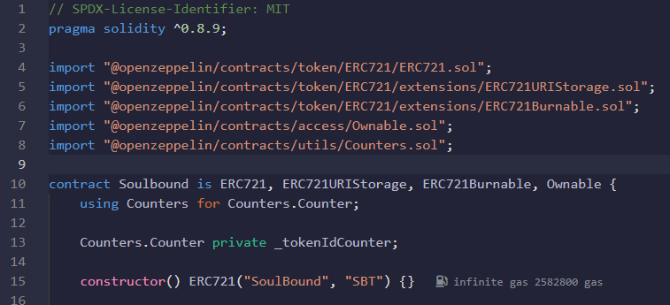

# Soulbound Token(거래불가능한 토큰)

_Soulbound_ 란 워크래프트 게임에서 나온 게임 용어로 Soulbound 아이템의 경우 캐릭터에 귀속되는 거래불가능한 아이템을 일컬는 말입니다.
따라서 `Soulbound Token`은 특정 주소에서만 소유하고 전송할 수 있는 토큰 유형입니다. 즉, `Soulbound Token` 이 생성되어 주소에 할당되면 다른 주소로 토큰을 양도하거나 소유할 수 없습니다.

[Soulbound Token 참고 링크](https://www.quicknode.com/guides/ethereum-development/smart-contracts/how-to-create-a-soulbound-token)

## Getting Started

1. [remix 사용법](docs/remix_tutorial.md)
2. [metamask 사용법](docs/metamask_guide.md)
3. [pinata 사용법](docs/pinata_guide.md)
4. [etherscan 사용법](docs/etherscan_guide.md)

### 코드 설명

`constructor() ERC721("토큰 이름", "토큰 심볼")` 의 경우 컨트랙트가 배포될 때 결정된다.
