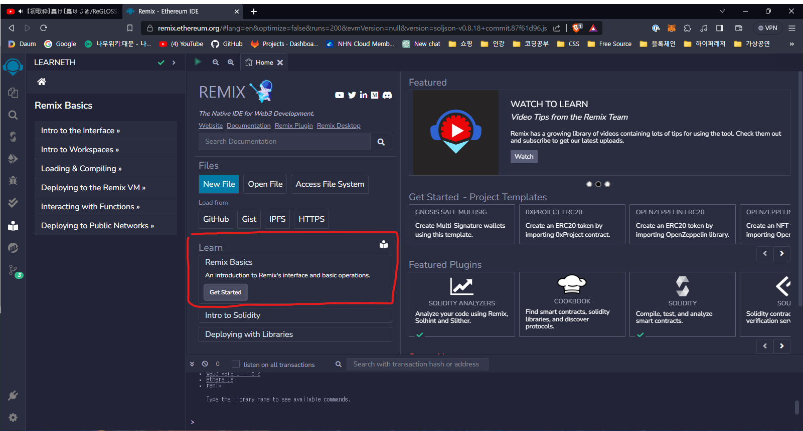
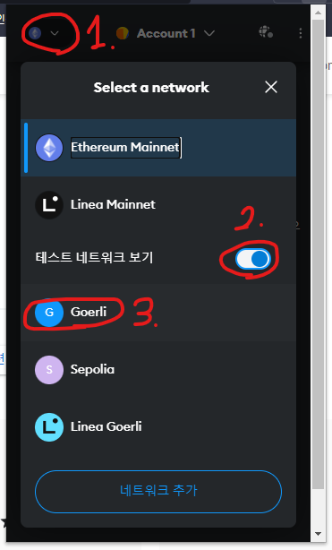

# Soulbound Token(거래불가능한 토큰)

_Soulbound_ 란 워크래프트 게임에서 나온 게임 용어로 Soulbound 아이템의 경우 캐릭터에 귀속되는 거래불가능한 아이템을 일컬는 말입니다.
따라서 `Soulbound Token`은 특정 주소에서만 소유하고 전송할 수 있는 토큰 유형입니다. 즉, `Soulbound Token` 이 생성되어 주소에 할당되면 다른 주소로 토큰을 양도하거나 소유할 수 없습니다.

[Soulbound Token 참고 링크](https://www.quicknode.com/guides/ethereum-development/smart-contracts/how-to-create-a-soulbound-token)

## 사전지식

### 1. Solidity 가이드

- [Solidity 문서](https://solidity-kr.readthedocs.io/ko/latest)

### 2. remix 가이드

[Remix] 홈 화면의 공식 가이드

[Remix]: https://remix.ethereum.org/

### 3. Metamask 설치

`Metamask`는 Web3 암호화폐 지갑으로 블록체인 네트워크와 상호작용하고 암호화폐를 전송하는 데 사용되는 Chrome 확장 프로그램입니다(SDK나 App의 형태로도 제공됨)

1. [Metamask](https://metamask.io)를 설치합니다.

2. 테스트 네트워크 보기를 설정합니다.

3. Goerli Faucet으로 테스트 ETH를 받습니다.
   [Faucet](https://goerlifaucet.com)

## 컨트랙트 배포

## Soulbound Token 발행

## Ethersca
